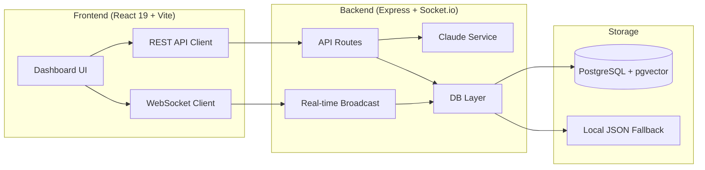
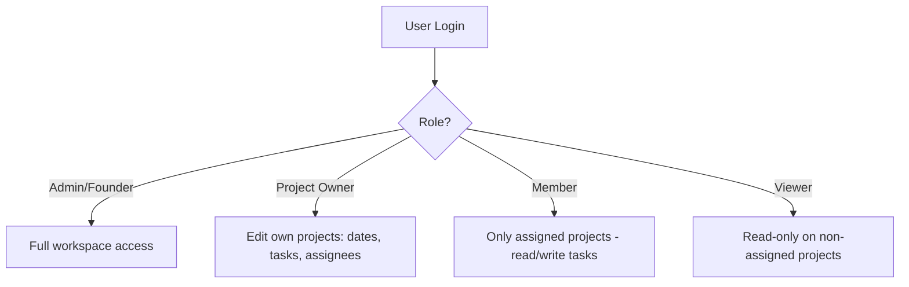

# Overall project report
_Exported on 6/14/2026 at 20:09:28 GMT+5:30 from Cursor (3.7.36)_

---

**User**

abhi tak overall project report

---

**Cursor**

I'll explore the StartupHub codebase and gather its structure, tech stack, and current state for an overall project report.


# StartupHub — Overall Project Report (Abhi Tak)

## Project Vision

**StartupHub** ek **AI-native unified workspace** hai jo startup teams ke liye banaya gaya hai. Problem: ideas WhatsApp/Slack mein kho jaati hain, context fragmented rehta hai, aur naye hires ko weeks lagte hain onboard hone mein.

**Solution:** Sab context ek jagah — real-time dashboard + auto-generated onboarding PDF.

---

## Repository Status

| Metric | Status |
|--------|--------|
| **Branch** | `main` (synced with `origin/main`) |
| **Commits** | 8 total |
| **Working tree** | Clean — koi uncommitted changes nahi |
| **Files** | ~37 source/config files |
| **Structure** | Monorepo: `frontend/` + `backend/` |

### Commit Timeline

1. `fc37fc6` — Initial commit  
2. `ffa6d46` / `e67404b` — README revisions  
3. `427a17d` — Frontend init (React + Vite + Tailwind)  
4. `f6be228` — Toast notifications + AI daily briefing panel  
5. `f9c9d19` — Daily briefing API + action item status  
6. `ff4e1e8` — UI improvements  
7. `6074e1c` — Status & deadline widgets fix (latest)

---

## Architecture



---

## Tech Stack (Actual)

| Layer | Technology |
|-------|------------|
| **Frontend** | React 19, TypeScript, Vite 8, Tailwind CSS, Lucide icons |
| **Backend** | Node.js, Express, Socket.io, TypeScript |
| **Database** | PostgreSQL (Supabase) **ya** local JSON fallback |
| **AI** | Anthropic Claude SDK (with regex/hash fallbacks) |
| **PDF** | jsPDF (server-side generation) |
| **Dev** | `concurrently` — ek command se dono servers |

---

## Implemented Features ✅

### 1. Real-time Dashboard
- WebSocket se live updates (`join_workspace` room)
- Decisions, action items, tasks, ideas, projects, GitHub PRs, blockers — sab ek view mein
- Connection status indicator (Live / Disconnected)

### 2. Idea Capture & Project Conversion
- **Cmd/Ctrl+K** se instant idea modal
- Idea → Project conversion with owner + deadline
- Claude se auto task breakdown (fallback rules bhi hain)

### 3. Message Ingestion Pipeline
Webhook endpoints:
- `POST /webhooks/whatsapp` (Twilio format)
- `POST /webhooks/slack`
- `POST /webhooks/github` (PR linking via embedding similarity)

**Async pipeline:** message save → embedding → decision extract → action items → daily digest → dashboard broadcast

### 4. AI Processing (Claude Service)
- Decision extraction  
- Action item extraction (owner, task, deadline)  
- Meeting notes summarization  
- Project breakdown generation  
- Blocker detection (task dependencies + cycle detection)  
- Daily briefing generation  

### 5. Semantic Search
- `GET /api/search?q=...` — 1536-dim vector search
- Messages, decisions, ideas, PRs across workspace

### 6. Onboarding PDF Generator
- `POST /api/pdf/generate` — branded 4-page PDF
- Decisions, digests, projects, tasks, action items included

### 7. Daily AI Briefing
- `GET /api/briefing` — greeting + bullet summary + highlights
- Frontend mein typewriter effect ke saath

### 8. UI Components
- Collapsible sidebar (Ideas / Projects / Tools)
- Project workspace view with blockers & decisions
- Toast notifications (new decision, action item, idea, project, blocker)
- Webhook simulator (Slack / WhatsApp / GitHub testing)
- Local idea comments (frontend-only, backend persist nahi)

### 9. Blocker & Cycle Detection
- `cycleDetection.ts` — dependency graph cycle detection
- `detectBlockers()` tasks par apply hota hai
- Test file: `cycleDetection.test.ts`

---

## API Endpoints Summary

| Endpoint | Purpose |
|----------|---------|
| `GET /dashboard` | Full workspace state |
| `GET /search` | Semantic vector search |
| `POST /ideas` | Create idea |
| `POST /projects/from-idea/:id` | Convert idea → project + tasks |
| `POST /pdf/generate` | Onboarding PDF download |
| `GET /briefing` | AI daily briefing |
| `POST /tasks/:id/status` | Update task status |
| `POST /action-items/:id/status` | Mark action item done |
| `POST /webhooks/*` | WhatsApp, Slack, GitHub ingestion |

---

## Smart Fallbacks (Offline / Demo Mode)

Project **bina external services ke bhi chal sakta hai**:

| Service | Fallback |
|---------|----------|
| **PostgreSQL** | Local JSON file (`fallback-db.json`) |
| **Claude API** | Regex-based extraction + rule-based summaries |
| **Embeddings** | Deterministic semantic hash (pgvector-style 1536-dim) |

Yeh hackathon/demo ke liye useful hai — API keys optional hain.

---

## README vs Reality Gap

README mein kuch cheezein **planned** hain jo abhi fully nahi hain:

| README Claim | Actual Status |
|--------------|---------------|
| shadcn/ui | ❌ Not used — custom Tailwind UI |
| Slack integration | ⚠️ Webhook endpoint hai, real Slack bot nahi |
| GitHub integration | ⚠️ Webhook + PR linking hai, OAuth/GitHub App nahi |
| Twilio WhatsApp | ⚠️ Endpoint ready, real Twilio wiring manual |
| Figma / Design-dev sync | ❌ Not started |
| `npm run db:migrate` | ❌ Script defined nahi — manual Supabase setup |
| Code → context mapping | ❌ Not implemented |
| Global shortcut (system-wide) | ⚠️ Sirf in-app Cmd+K |

---

## Known Limitations / TODOs

1. **Idea comments** — sirf frontend state mein, database persist nahi  
2. **Single workspace** — hardcoded `DEFAULT_WORKSPACE_ID`  
3. **No auth** — koi login/user management nahi  
4. **No real migrations** — DB schema manual setup  
5. **Task creation UI** — toast dikhata hai, actual API call nahi  
6. **Deadline update** — modal save karta hai locally, backend update limited  
7. **Tests** — sirf `cycleDetection.test.ts`; no CI pipeline  
8. **Deployment** — Vercel/Railway mentioned in README, config files nahi  

---

## File Structure

```
StartupHub/
├── package.json          # Root: concurrently start both
├── README.md
├── backend/
│   ├── src/
│   │   ├── index.ts              # Express + Socket.io server
│   │   ├── routes/api.ts         # All REST endpoints (~740 lines)
│   │   ├── db/index.ts           # PG + JSON fallback (~780 lines)
│   │   └── services/
│   │       ├── claude.ts         # AI + fallbacks (~570 lines)
│   │       └── socket.ts         # Real-time dashboard
│   ├── cycleDetection.ts         # Graph cycle utility
│   └── cycleDetection.test.ts
└── frontend/
    └── src/
        ├── App.tsx               # Main dashboard (~760 lines)
        ├── components/
        │   ├── DailyBriefing.tsx
        │   ├── ProjectWorkspace.tsx
        │   └── Toast.tsx
        ├── hooks/useWebSocket.ts
        └── services/api.ts
```

---

## Overall Assessment

| Category | Score | Notes |
|----------|-------|-------|
| **MVP Completeness** | ~75% | Core loop working: capture → extract → dashboard → PDF |
| **UI/UX** | Good | Polished dark theme, responsive sidebar, toasts |
| **Backend** | Solid | Well-structured routes, async pipelines, fallbacks |
| **AI Integration** | Partial | Claude active when key present; smart offline mode |
| **Production Readiness** | Low | No auth, migrations, CI, or deployment config |
| **Hackathon Demo** | Strong | Webhook simulator se end-to-end demo possible |

---

## Bottom Line

**StartupHub abhi tak ek functional hackathon MVP hai** jisme:

- Real-time AI workspace dashboard ✅  
- Message ingestion (WhatsApp/Slack/GitHub simulate) ✅  
- Idea → Project → Tasks pipeline ✅  
- Semantic search ✅  
- Onboarding PDF ✅  
- Daily AI briefing ✅  
- Blocker detection ✅  

**Agla phase** ke liye priority ho sakti hai: real Slack/Twilio wiring, database migrations, authentication, aur production deployment.

Agar chaho to main is report ko **demo script**, **pitch deck outline**, ya **next-sprint task list** mein bhi convert kar sakta hoon.

---

**User**

ok so let's see what's remaining STARTUPHUB: PROJECT DOCUMENTATION

PROBLEM STATEMENT
PROBLEM 1: IDEATION CHAOS
What happens:
Ideas mentioned in WhatsApp/Slack scattered across different channels
Meeting notes (2 hours) split into: email, Google Docs, notebook, voice memos
Niche/important details buried in 200 lines of unstructured text
Example: "Boss said in meeting we need dark mode. But why? What's the timeline? Who's building? What's the technical constraint?" → Nobody remembers
Same idea discussed 3 times because it wasn't tracked
40% of good ideas never become projects
Cost:
5+ hours/week searching for idea details
3-5 days wasted repeating discussions
Ideas lost = opportunity cost

PROBLEM 2: EXECUTION CHAOS
What happens:
Dev starts feature: "Why was this decision made?" → Finds answer in Slack from 3 days ago (30 mins scrolling)
Design decision in Figma comment → Dev never checks Figma during coding → Rework
Meeting 2 weeks ago: "Use PostgreSQL" → Dev forgot, uses MySQL → Rework
Blocker: "Dev waiting on API spec" → Buried in WhatsApp → Hidden for 3 days
New hire: "What's the architecture?" → Takes 3 weeks to understand
Engineer context-switches 15 times before writing code
Cost:
2 hours/day per engineer lost to context-switching
30% of work is rework (fixing forgotten decisions)
3-5 day shipping delays per feature
Design-dev mismatch = 1-2 days rework

SOLUTION: STARTUPHUB
StartupHub is unified AI-native workspace solving both problems:
IDEATION SIDE:
Captures ideas instantly (global shortcut)
Auto-links related ideas (AI semantic linking)
Extracts meeting details (decisions, constraints, metrics)
Tracks idea → project conversion
Monitors momentum (stalled ideas alert)
EXECUTION SIDE:
Dashboard shows all context (decisions, design, constraints)
Code → context mapping (why was this written?)
Semantic search (across all sources)
Design-dev sync (Figma linked to GitHub)
Blocker detection (circular deps auto-flagged)

IDEATION FEATURES
1. Frictionless Capture
Global shortcut (Cmd+K) to capture idea instantly
Idea goes to inbox (not lost in chat)
Auto-tagged by AI
Source tracked (WhatsApp, Slack, meeting)
2. Meeting Notes Integration
Notes auto-transcribed (if recording available)
AI extracts: decisions, constraints, metrics, action items
Linked to relevant ideas automatically
Example: Meeting discusses "dark mode" → auto-linked to dark mode idea
3. Semantic Idea Engine
AI finds related ideas: "This is similar to dark theme from 3 weeks ago"
Connects duplicate ideas
Shows idea history
Prevents duplicate work
4. AI Daily Briefing
Every morning: "Here's what's happening"
Shows: New ideas, stalled projects, blockers, priorities
Ranked by importance
5. AI Assistant Panel
Context-aware suggestions: "This idea is similar to X, might combine?"
Brainstorming help: "What tasks would this need?"
Reminders: "This idea was discussed 2 weeks ago, status?"
Next-step guidance
6. Idea → Project Pipeline
One-click: "Promote idea to project"
Auto-generates: Requirements (from meeting notes), tasks (breakdown), owner, deadline
Full documentation created automatically
7. Momentum Tracking
Tracks: Project activity, task progress, blocker status
Alerts: "This project hasn't moved in 3 days"
Shows: Who's working, what's stuck, what's priority

EXECUTION FEATURES
1. Communication Hub (WhatsApp + Slack)
All messages in one view
AI extracts: decisions, action items
Outputs: Daily digest, decision log, who committed to what
2. Context Mapping (GitHub ↔ Communication)
Dev highlights code → system finds original discussion
Shows: Slack thread that led to decision, GitHub issue, Figma design comment, meeting notes
Output: One click → full context why code was written
3. Design-Code Connection
Figma comment linked to GitHub PR
Design → code sync automatic
Alerts if PR deviates from design
Shows design rationale in code review
4. Smart Search + Context Graph
"What was decided about authentication?" → instant answer
Searches across: Slack, GitHub, Figma, meeting notes
Returns: Decision, who made it, when, reasoning
5. Blocker Detection
AI identifies: "Dev waiting on design", "Design waiting on API"
Auto-detects circular dependencies
Alerts responsible person
Escalates if blocked 24+ hours
6. New Hire Onboarding
AI generates context doc for new person
Includes: Project overview, key decisions, architecture, design system, team style
Reduces ramp time: 3 weeks → 3 days
7. Project Context Dashboard
One screen shows: Overview, requirements, design, constraints, blockers, GitHub PRs, Slack threads
Everything accessible instantly
No searching needed

TECH STACK
Frontend
React 18 + TypeScript (not Next.js - simpler, faster)
Vite (faster builds than webpack)
TanStack Query (data fetching)
Zustand (state management)
Tailwind + shadcn/ui (styling)
Backend
Node.js 20 + Express
Socket.io (real-time updates)
Simple message processing (no queues)
Database
PostgreSQL (Supabase) - structured data
pgvector - embeddings storage
AI/NLP
Claude 3.5 Sonnet (summarization, extraction)
Claude Embeddings (semantic search)
Integrations
Twilio (WhatsApp)
Slack Bot API
GitHub REST API
Deployment
Vercel (frontend React + Vite)
Railway (backend Express)
Supabase (database)
Cost: $0 (all free tiers)

ARCHITECTURE
WhatsApp/Slack/GitHub/Figma (sources)
        ↓
   Twilio/APIs (webhooks)
        ↓
Node.js Backend (Express)
        ├─ OAuth2 auth
        ├─ Webhook handlers
        ├─ API routes
        └─ Queue worker
        ↓
Bull Queue (async processing)
        ↓
Claude API (summarization, embeddings)
        ↓
PostgreSQL + pgvector (storage)
        ↓
Supabase Realtime (WebSocket)
        ↓
React Frontend + VS Code Extension (UI)


DATA FLOW: Message Processing
Slack message: "We'll use JWT"
        ↓
Webhook hits backend → Log to DB → Return 200 OK
        ↓
Queue job: "Process message"
        ↓
Worker processes:
  1. Claude Embeddings: "We'll use JWT" → [vector]
  2. Store in pgvector
  3. Claude extraction: "Decision: Use JWT"
  4. Store decision in DB
  5. Update daily digest
        ↓
Supabase Realtime triggers
        ↓
WebSocket push to frontend: "New decision"
        ↓
React updates dashboard in real-time


DATA FLOW: Code Context
Dev highlights code in VS Code
        ↓
Right-click: "Find Context"
        ↓
Extension sends to backend:
  - Code text
  - File path
  - Commit hash
  - Git remote
        ↓
Backend processes:
  1. Generate embedding of code
  2. Vector search in pgvector
  3. Find related messages, PRs, design comments
  4. Rank by relevance
  5. Return top 5 results
        ↓
VS Code sidebar shows:
  - Slack thread
  - GitHub issue
  - Figma comment
  - Meeting note
        ↓
Dev clicks any → opens original source


MVP (WEEKS 1-2)
Build:
WhatsApp ingestion (Twilio)
Daily digest generation (Claude)
Decision extraction
Action items tracking
React dashboard (digest + decisions + actions)
Idea → Project → Tasks workflow
PostgreSQL + pgvector setup
Basic search
Tech delivered:
Node.js backend
React dashboard
PostgreSQL + pgvector
Claude integration
Twilio integration
Deploy: Vercel + Supabase

V1 (WEEKS 3-4)
Add:
Slack integration
GitHub integration
Code-to-context mapping
Semantic search
Blocker detection

V2 (WEEKS 5-6+)
Add:
Figma integration
VS Code extension
PDF export
Onboarding context auto-generation
Real-time notifications

TEAM (4 PEOPLE)
Role
Responsibility
Backend Lead
Node.js, Twilio, Slack/GitHub APIs, pgvector, Claude calls
AI/NLP Lead
Claude prompts, embeddings, semantic search, extraction accuracy
Frontend Lead
React dashboard, search UI, real-time updates, VS Code extension
DevOps/Validation
Supabase, Vercel, test with startup, measure impact


IMPACT METRICS
Before:
Ideation chaos: 40% ideas lost, 5+ hrs/week searching
Execution chaos: 2 hrs/day context-switching, 30% rework
Feature shipping: 5 days
New hire ramp: 3 weeks
Design-dev rework: 1-2 days per feature
After:
Idea capture: 100%, 5 mins/week searching
Context-switching: 15 mins/day, 5% rework
Feature shipping: 2 days
New hire ramp: 3 days
Design-dev sync: 95%, 0 days rework
Annual savings (5-person team): $87k

and I'm thinking user login bhi add karte hai if possible, then we can add more features, like whoever creates the proj can edit dates, assign roles or tasks etc. And normal users or employees just get added to relevant projects and can only look at projs that they aren't directly working on so iss sab main se what's remaining?

---

**Cursor**

Documentation ke against actual codebase check kar raha hoon — implemented, partial, aur remaining features clearly map karunga.


# StartupHub — Documentation vs Reality: Kya Bacha Hai?

Tumhari doc ke against actual codebase map kiya. Neeche **Done**, **Partial**, aur **Remaining** clearly hai — plus tumhara naya **login + roles** idea.

---

## Quick Scorecard

| Phase | Doc Target | Actual Progress |
|-------|-----------|-----------------|
| **MVP (Weeks 1–2)** | ~90% | Core loop kaam karta hai, real integrations/deploy missing |
| **V1 (Weeks 3–4)** | ~35% | Search + blockers backend pe hain; code-context nahi |
| **V2 (Weeks 5–6+)** | ~25% | PDF done; Figma, VS Code, real notifications nahi |
| **Auth + Roles** (tumhara idea) | 0% | Schema hint hai, koi login/RBAC nahi |

---

## IDEATION FEATURES

| # | Feature (Doc) | Status | Kya Hai / Kya Nahi |
|---|---------------|--------|---------------------|
| 1 | **Frictionless Capture** (global Cmd+K) | 🟡 Partial | In-app `Cmd+K` ✅ · Global OS shortcut ❌ · Inbox ✅ · AI auto-tag ❌ · Source tracking basic ✅ |
| 2 | **Meeting Notes Integration** | 🟡 Partial | Text se decisions/actions extract ✅ · Transcription ❌ · Meeting → idea auto-link ❌ · Constraints/metrics extract weak |
| 3 | **Semantic Idea Engine** | 🟡 Partial | Embeddings + search backend ✅ · "Related ideas" UI ❌ · Duplicate merge ❌ · Idea history ❌ |
| 4 | **AI Daily Briefing** | ✅ Done | `/api/briefing` + UI with typewriter effect |
| 5 | **AI Assistant Panel** | ❌ Missing | Context suggestions, brainstorm, reminders, next-step guidance — kuch nahi |
| 6 | **Idea → Project Pipeline** | ✅ Mostly Done | Convert + Claude task breakdown ✅ · Requirements doc auto-generate limited |
| 7 | **Momentum Tracking** | 🟡 Partial | Briefing mein stalled projects mention ✅ · Dedicated "3 days no movement" alerts ❌ · Activity dashboard ❌ |

---

## EXECUTION FEATURES

| # | Feature (Doc) | Status | Kya Hai / Kya Nahi |
|---|---------------|--------|---------------------|
| 1 | **Communication Hub** (WhatsApp + Slack) | 🟡 Partial | Webhook endpoints + async pipeline ✅ · Unified messages view UI ❌ · Daily digest stored ✅ · Digest UI weak |
| 2 | **Code → Context Mapping** | ❌ Missing | VS Code extension ❌ · Highlight code → find discussion ❌ |
| 3 | **Design-Code Connection** (Figma) | ❌ Missing | Koi Figma integration nahi |
| 4 | **Smart Search + Context Graph** | 🟡 Partial | Semantic search ✅ · Cross-source graph ❌ · "Who decided, when, why" structured answer ❌ |
| 5 | **Blocker Detection** | 🟡 Partial | `detectBlockers()` + `cycleDetection.ts` backend ✅ · **ProjectWorkspace mock data use karta hai** ❌ · 24h escalation ❌ · Notify responsible person ❌ |
| 6 | **New Hire Onboarding** | ✅ Done | PDF generator 4-page branded doc |
| 7 | **Project Context Dashboard** | 🟡 Partial | Layout hai · Real decisions/tasks/blockers wire nahi — hardcoded `MODALS` demo data |

---

## TECH STACK & ARCHITECTURE GAPS

| Doc Says | Actually Built |
|----------|----------------|
| React 18 | React **19** ✅ |
| TanStack Query | ❌ Raw `fetch` |
| Zustand | ❌ `useState` only |
| shadcn/ui | ❌ Custom Tailwind |
| Bull Queue worker | ❌ `setTimeout` async |
| OAuth2 auth | ❌ |
| Claude Embeddings API | ❌ Deterministic hash fallback |
| Supabase Realtime | Socket.io (custom) ✅ equivalent |
| Twilio WhatsApp | Endpoint only, no Twilio SDK |
| Slack Bot API | Manual webhook, no Events API / signing |
| GitHub REST API | Simulated webhook only |
| Vercel + Railway deploy | ❌ No config files |
| `npm run db:migrate` | ❌ Schema inline in code |
| VS Code Extension | ❌ |

---

## Kya Actually Kaam Karta Hai (Solid ✅)

Yeh confidently demo-ready hai:

1. Real-time dashboard (Socket.io)
2. Idea capture → inbox
3. Idea → Project → auto tasks (Claude/fallback)
4. WhatsApp/Slack/GitHub **simulator** + webhook pipeline
5. Decision + action item extraction
6. Semantic vector search
7. AI daily briefing
8. Onboarding PDF download
9. Toast notifications on live updates
10. Local JSON fallback (bina DB/API keys ke chalta hai)

---

## Kya Bacha Hai — Priority Order

### 🔴 P0 — Demo ko "real" banane ke liye

| Task | Why |
|------|-----|
| **ProjectWorkspace ko real data se wire karo** | Abhi blockers/decisions/tasks mock `MODALS` se aate hain — sabse bada gap |
| **Task create/edit UI → backend** | "Add task" sirf toast dikhata hai |
| **Project deadline/owner persist karo** | Modal save local state only |
| **Messages panel** | Communication hub ka core UI missing |
| **Real Twilio + Slack wiring** | Abhi simulator hai |

### 🟠 P1 — V1 complete karne ke liye

| Task | Why |
|------|-----|
| **Related ideas UI** (semantic linking) | Doc ka core ideation differentiator |
| **Meeting → idea auto-link** | Embedding similarity already hai backend mein |
| **Blocker alerts** (24h+ stuck) | Detection hai, escalation nahi |
| **GitHub real webhook** + PR list in dashboard | REST API polling ya webhook secret verify |
| **Code → context** (pehle web UI, phir VS Code) | V1 flagship feature |
| **Context graph search results** | Sirf flat list, no "who/when/why" |

### 🟡 P2 — V2 + polish

| Task |
|------|
| Figma integration |
| VS Code extension |
| AI Assistant side panel |
| Momentum alerts ("stalled 3 days") |
| Global OS shortcut (Electron/Tauri ya browser extension) |
| Meeting transcription hook |
| Deployment (Vercel + Railway + Supabase) |
| Real Claude embeddings (jab API available) |
| Bull queue for production-scale processing |

---

## Tumhara Naya Idea: Login + Roles — Yeh Bhi Remaining (0%)

Yeh bilkul sahi direction hai — bina iske multi-user product nahi ban sakta. Abhi:

- `users` table schema mein hai, par **koi login/session nahi**
- `owner` / `assigned_to` sirf **plain text strings** hain
- **Ek hi hardcoded workspace** — `00000000-0000-0000-0000-000000000000`
- Koi project membership ya permission check nahi

### Auth + RBAC ke liye kya banana padega



**Database tables (new):**
- `project_members` — `user_id`, `project_id`, `role` (`owner` | `editor` | `viewer`)
- `sessions` / JWT refresh tokens
- `invites` — email invite to project

**API middleware:**
- Har route pe `req.user` + workspace check
- Project routes pe: creator/owner hi dates, roles, task assign edit kar sake
- Members sirf apne projects dekhein; baaki projects **hidden** ya read-only

**Frontend:**
- Login/signup page (Supabase Auth sabse fast — already doc mein Supabase hai)
- Project settings: owner, deadline, member invite
- Task board: assign dropdown (real users list se)
- Sidebar: sirf user ke projects

**Estimated effort:** ~3–5 days focused work (Supabase Auth use karo to fastest)

---

## Recommended Build Order (Agar Aage Badhna Ho)

```
Week A — Make it real
  1. Wire ProjectWorkspace to live dashboard data
  2. Task CRUD + project edit APIs
  3. Messages/decisions panel in UI

Week B — Auth foundation (tumhara idea)
  4. Supabase Auth login
  5. project_members + role middleware
  6. Owner-only edit vs member view-only

Week C — V1 differentiators
  7. Related ideas + meeting linking
  8. Real Slack/Twilio
  9. Blocker escalation

Week D — V2
  10. Code context (web first)
  11. Figma
  12. Deploy
```

---

## One-Line Summary

**MVP ka backend brain ~75% ready hai, par frontend abhi bhi demo/mock data pe chal raha hai.** Doc ke hisaab se sabse bade holes: **real dashboard wiring, integrations (Slack/Twilio/GitHub/Figma), code-context, AI assistant panel, aur tumhara auth/roles system** — yeh sab abhi remaining hai.

Agar chaho to next step mein main **sirf auth + roles ka detailed schema + API design** likh sakta hoon, ya **P0 list (mock data hatake real wiring)** se code shuru kar sakte hain. Kaunsa pehle?

